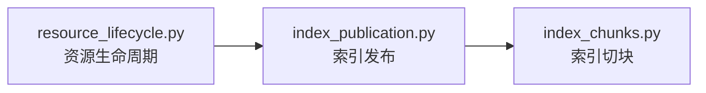

# RAG Domain Flow

## 资源与索引构建

```text
resource_lifecycle.py（资源生命周期）
  -> index_publication.py（索引发布）
  -> index_chunks.py（索引切块）
```



## 检索与证据生成

```text
retrieval_planning.py（检索规划）
  -> retrieval_hits.py（多路召回命中）
  -> candidate_fusion.py（候选融合）
  -> evidence_hydration.py（证据水合）
  -> reranking.py（重排）
  -> parent_aggregation.py（父块聚合）
  -> evidence_selection.py（证据选择）
  -> evidence_output.py（证据输出）
  -> retrieval_execution.py（检索执行结果）
  -> answerability.py（可回答性判断）
  -> context_assembly.py（上下文组装）
```


## 内部契约与枚举

```text
enums.py（内部枚举）
  -> ports.py（领域端口）
```


