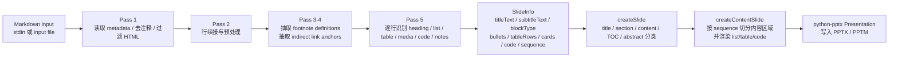
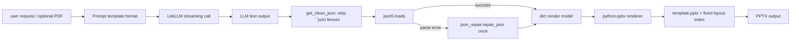
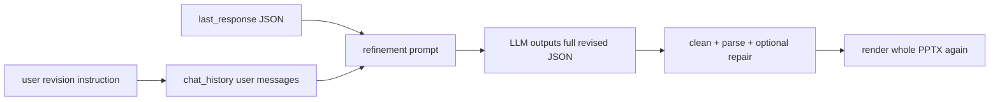
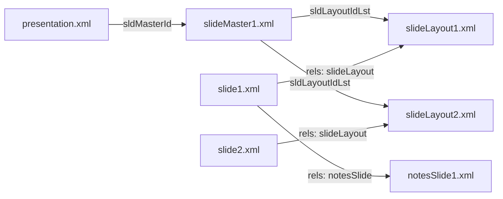
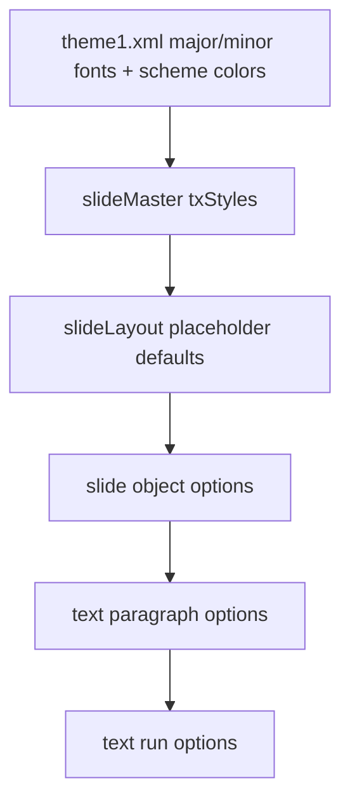

# md2pptx 蒸馏报告

来源：本地仓库 `md2pptx/`，重点阅读主脚本 `md2pptx`、`processingOptions.py`、`paragraph.py` 与 `docs/user-guide.md`。当前仓库没有 `references/` 目录，实际参考路径为当前服务目录下的 `md2pptx/`。

## 1. 转换主链路

md2pptx 的实现不是 CommonMark AST 驱动，而是多遍逐行扫描 Markdown，最后组装一个轻量的 `SlideInfo` 中间对象交给 python-pptx renderer。



关键代码锚点：

| 阶段 | 代码位置 | 行为 |
|---|---|---|
| 输入读取 | `md2pptx:4701-4719` | 支持 `input output` 两个参数，或只传 `output` 并从 `stdin` 读取。 |
| metadata / HTML / comment 预处理 | `md2pptx:4773-4864` | 第一遍抽取 metadata，保留 md2pptx 动态元数据，过滤普通 HTML 注释和大多数 HTML 块。 |
| 行续接 | `md2pptx:5797-5846` | 第二遍把普通连续文本行合并为一行，结构化行不合并。 |
| 主解析 | `md2pptx:6416-6718` | heading 切 slide，list/table/media/code/notes 分类。 |
| 中间结构 | `md2pptx:122-145` | `SlideInfo` 承载渲染所需的 slide 信息。 |
| slide 分发 | `md2pptx:4077-4152` | `createSlide()` 根据 `blockType` 和特殊标题分发到对应 renderer。 |
| 内容渲染 | `md2pptx:1897-2011` | `createContentSlide()` 根据 `sequence` 渲染 list/table/code block。 |

## 2. Markdown 分段规则

### 输入读取和预处理

1. 输入来源很简单：`sys.argv` 超过两个参数时，第一个是输入文件、第二个是输出文件；只有一个输出文件参数时，从 `stdin` 读全部行；没有参数或空输入会直接终止。
2. md2pptx 的所谓 front matter 实际是 metadata 区，不是 YAML front matter。它读取“开头到第一个空行或第一个 heading”为止的行，用 `key: value` 正则解析。
3. 普通 HTML 注释会被剔除；但 `<!-- md2pptx: ... -->` 会被保留为动态元数据。
4. 大多数 HTML 块会被吞掉；少数白名单结构会保留，包括 `<a id=...>`、`<span ...>`、`<code>`、`<pre>`、`<video>`、`<audio>`、`<br/>`、`<figcaption>`。
5. fenced code 的内部行会保留，避免被 metadata 或 HTML 过滤逻辑误删。
6. 第二遍会做行续接：如果当前行不是空行，也不是 `* # \ | 数字 !` 这些结构起始，并且上一行不是 H1/H2、表格、缩进代码、代码块，则把当前行接到上一行后面，中间加空格。

### slide 切分

| Markdown 结构 | 是否切 slide | 规则 |
|---|---:|---|
| `#` 默认 H1 | 是 | presentation title slide。遇到新 H1/H2/H3 时先 flush 上一页。 |
| `##` 默认 H2 | 是 | section slide。 |
| `###` 默认 H3 | 是 | content slide 的起点。 |
| `####` 默认 H4 | 否 | card，不新建 slide，追加到当前 slide 的 `cards`。 |
| `<hr/>`、`---`、`***`、`___` | 是 | 被改写为 `### &nbsp;`，用于创建无标题 slide。 |
| 空行 | 否 | 只结束 metadata、结束 title/subtitle 捕获，或帮助 notes 判定。 |
| front matter / metadata | 否 | 只影响全局或动态配置，不产生 slide。 |
| 普通段落 | 否 | 在 H1/H2 的标题态中是 subtitle；其他位置基本进入 speaker notes。 |

### heading level 可配置

默认层级：

| level | 含义 |
|---:|---|
| 1 | presentation title |
| 2 | section |
| 3 | content |
| 4 | card |

`TopHeadingLevel: N` 会整体平移层级：title=N，section=N+1，content=N+2，card=N+3。这个设计适合把同一份 Markdown 同时用于长文档和演示文稿。

## 3. Slide 类型分类规则

md2pptx 的 slide 类型由两层规则共同决定：

1. 解析阶段维护 `blockType`，主要值是 `title`、`section`、`content`、`table`、`code`。
2. renderer 阶段根据 `blockType`、特殊标题、以及 `sequence` 再细分渲染行为。

| Markdown 结构 | 识别出的 slide 类型 | 后续渲染行为 | 是否值得我们吸收 |
|---|---|---|---|
| H1，例如 `# Title` | title slide，`blockType="title"` | 使用 `TitleSlideLayout`，标题写入 title shape，后续标题态文本作为 subtitle。 | 是。heading level 到 slide role 的映射清晰，可吸收。 |
| H2，例如 `## Section` | section slide，`blockType="section"` | 使用 `SectionSlideLayout`；可作为 PPT section 起点和 TOC 导航节点。 | 是。章节页单独建模值得吸收。 |
| H3，例如 `### Content` + bullet list | content slide，`blockType="content"` | 使用 `ContentSlideLayout`；list block 写入 body placeholder 或文本框。 | 是。最常见内容页规则。 |
| H3 + `|...|` 表格 | table slide，`blockType="table"` | 仍由 `createContentSlide()` 渲染；`sequence` 中为 `table`，交给 `createTableBlock()`。 | 是，但建议我们用 AST table，不照搬字符串 split。 |
| H3 + 单图 `` | image slide，本质是 table/media slide | 图片行会进入 `tableRows`；renderer 若判断 1x1、1x2、2x1、2x2 且单元格是 media，则走 graphics grid 渲染。 | 是。把图片视为特殊 table/media block 的统一模型可借鉴。 |
| H3 + 多图同一行或小表格 | image/grid slide，本质是 table/media slide | `parseMedia()` 抽取图片、可点击图片、视频、音频；按格子布局缩放。 | 部分吸收。媒体 grid 有价值，但规则需更严格。 |
| H3 + fenced code | code slide，`blockType="code"` | `sequence` 中为 `code`；支持普通 backticks、`dot` GraphViz、`funnel`、`run-python` 等分支。 | 吸收普通 code block；不要吸收 `run-python`。 |
| H3 + indented 4 spaces | code slide | 非 list 状态下 4 空格缩进触发 code block。 | 部分吸收。兼容 Markdown 可保留，但需避免误判。 |
| H4，例如 `#### Card` | card inside current slide | 不切 slide；创建 `Card`，其 bullets 和 media 归入该 card。 | 可选。卡片结构可以吸收为一种高级布局。 |
| `* item` | list block | `bulletRegex` 只接受星号 `*`；缩进转成 level；`sequence.append("list")`。 | 是，但不应只支持 `*`。 |
| `1. item` | ordered list item | 仍在 list block 中，`listItemType="numbered"`，renderer 调 PowerPoint 编号。 | 是。ordered/bullet 共用 list item model 值得吸收。 |
| 普通 paragraph | subtitle 或 notes，不是 content body | H1/H2 标题态中进入 `subtitleText`；其他非结构行累计到 `notes_text`。 | 不建议。我们应支持 paragraph 作为正文 block。 |
| table 后一行 `[caption]` | table caption | 仅当该行紧跟 table 最后一行时，存入 `tableCaptions`。 | 可吸收概念，但语法需更标准。 |
| `<figcaption>...</figcaption>` | figure caption | 表格/media 状态下追加到 `figureCaptions`。 | 可吸收，但建议统一为 AST caption。 |
| `<!-- md2pptx: key: value -->` | dynamic metadata | 不产生 slide，改变当前 option stack。 | 部分吸收。适合 per-slide 配置，但需 schema 化。 |

### 内容 block 的顺序模型

md2pptx 支持一页多个内容块，靠 `sequence` 保存出现顺序，例如 `["list", "table", "code"]`。`createContentSlide()` 根据 `contentSplitDirection` 和 `contentSplit` 把内容区域切成多个 rectangle，然后按顺序调用：

| sequence item | renderer |
|---|---|
| `list` | `createListBlock()` |
| `table` | `createTableBlock()` |
| `code` | `createCodeBlock()` |

默认最多渲染 10 个 block，超过会打印警告并截断。

## 4. Notes 解析方式

md2pptx 没有使用专门的 notes fence，而是用“无法识别为 slide 内容的普通文本”作为 notes。

解析规则：

1. slide 内容之后留空行，再写普通段落，这些段落会累计到全局 `notes_text`。
2. 对 H1/H2 title/section slide，heading 后、空行前的普通文本会作为 subtitle；空行后的普通文本才是 notes。
3. 对 content slide，普通 paragraph 不会作为正文，而会进入 notes。
4. notes 可散布在 slide 内容之间：比如 code block 后写一段说明，再写另一个 code block，所有说明段会汇总到同一页 notes。
5. notes 不支持结构化 block，比如 bullet list 会被主解析器识别成页面 bullet，不会作为 notes。
6. 当遇到下一张 slide 的 heading，或处理文件末尾时，调用 `createSlideNotes(slide, notes_text)` 写入当前 slide。

存储与写入：

1. 解析过程中 notes 暂存在字符串变量 `notes_text`。
2. `createSlideNotes()` 会 `strip()` 掉外围空白。
3. 如果 `slide.notes_slide.notes_text_frame.text` 已经非空，则直接返回，避免覆盖已有 notes。
4. 写入时使用 python-pptx 的 `slide.notes_slide.notes_text_frame`。
5. notes 文本用 `addFormattedText()` 写入，因此可复用部分 inline formatting、entity、hyperlink 处理。

值得吸收：

| 点 | 建议 |
|---|---|
| notes 和 slide content 分离存储 | 应吸收。我们的中间结构应有 `speaker_notes: []`。 |
| 写入 PPTX speaker notes | 应吸收。 |
| notes 支持 inline formatting | 可吸收。 |
| 普通 paragraph 默认当 notes | 不应吸收。会让内容丢失，业务风险高。 |
| notes 可散布在多个 block 之间再聚合 | 可选。建议我们只支持显式 notes block，降低歧义。 |

## 5. Template 载入方式

### metadata/front matter

md2pptx 通过开头 metadata 行读取模板：

```markdown
template: Martin Template.pptx
```

兼容旧 key：

```markdown
master: Martin Template.pptx
```

metadata 不是 YAML，也没有 `---` 分隔符。它只用 `^(.+):(.+)` 解析 key/value；无法解析嵌套结构、数组对象或强 schema。

### CLI 参数

CLI 只处理输入/输出文件：

```bash
python3 md2pptx output.pptx < input.markdown
python3 md2pptx input.markdown output.pptx
```

没有发现独立的 CLI template 参数。模板只能通过 metadata 中的 `template`/`master` 指定。

### 查找顺序与 fallback

模板查找顺序：

1. 按 metadata 里的路径原样查找，支持 `~` 展开。
2. 如果找不到，再拼到 md2pptx 安装目录下查找。
3. 如果仍找不到，打印警告，并回退到 `python-pptx` 内置空白模板继续生成。

如果模板 presentation 至少有一张 slide，md2pptx 会把第一张模板 slide 改造成 processing summary slide，用来展示 metadata 和运行信息；后续真实内容 slide 追加在后面。可通过 `DeleteFirstSlide: yes` 删除该 summary。

模板布局编号默认值：

| metadata key | 默认 layout index | 用途 |
|---|---:|---|
| `TitleSlideLayout` | 0 | presentation title |
| `SectionSlideLayout` | 1 | section |
| `ContentSlideLayout` | 2 | bullet/card content |
| `TitleOnlyLayout` | 5 | table/code/image/title-only |
| `BlankLayout` | 6 | blank/no-title slide |

对我们的启发：

1. 模板来源应允许“文档 front matter + API 参数”双入口，且 API 参数优先级更高。
2. 模板查找必须被限制在受控 template registry，不应任意读本地路径。
3. fallback 可以保留，但应明确标记为 degraded mode，并产生日志/诊断。
4. layout role 不应暴露为裸 index，应该是 schema 化 role 名称，例如 `title`, `section`, `content`, `image`, `table`, `code`。

## 6. 可蒸馏设计点

按优先级排序：

1. 引入明确的 `SlideInfo`/render model 中间层：至少包含 `title`、`subtitle`、`role`、`blocks`、`speaker_notes`、`layout_hints`、`source_range`。
2. 用 heading level 映射 slide role：默认 H1 title、H2 section、H3 content，并允许 front matter 调整 top heading level。
3. 将 slide splitting 和 rendering 解耦：解析阶段只产出中间结构，renderer 阶段再决定 PPTX layout。
4. 保留 `sequence` 思路：一页多个 block 时记录 block 顺序，再由布局器按顺序切分内容区域。
5. 把 table/image/video/audio 统一成 media/table block：一张图、多张图、图表格可以走同一个 grid/layout 算法。
6. 支持 per-slide dynamic metadata，但要 schema 化：例如 HTML comment 可变成安全的 directive block，校验 key、类型、作用域。
7. 支持无标题 slide：水平线或显式 directive 可转成空标题 content slide。
8. 对过多 block 设置上限与诊断：md2pptx 的 `maxBlocks=10` 和截断警告值得吸收，但我们应在生成前给出可恢复的 validation error 或自动拆页策略。
9. notes 写入 PPTX speaker notes：应成为 render model 的一等字段，而不是后处理字符串。
10. 模板缺失 fallback：可以回退到默认模板继续生成预览，但需要在结果 metadata 中暴露 warning。

## 7. 不应该吸收的点

1. 不应把普通 paragraph 默认归入 notes。我们的业务里 paragraph 很可能是正文内容，不能静默消失到 speaker notes。
2. 不应只用正则和逐行状态机解析 Markdown。md2pptx 的规则可读，但面对嵌套 Markdown、复杂表格、front matter、HTML 混排时脆弱；我们应基于 Markdown AST。
3. 不应使用无 schema 的 `key: value` metadata。需要严格 schema、类型校验、默认值、错误定位。
4. 不应允许 Markdown 随意控制底层样式、颜色、layout index。应限制为业务允许的 layout hints，避免用户输入破坏品牌模板。
5. 不应允许任意本地模板路径。模板应来自 registry、租户配置或受控对象存储。
6. 不应吸收 `run-python` code block。它允许 Markdown 执行任意 Python，安全风险不适合服务端业务。
7. 不应把图片 slide 伪装成 tableRows。我们可以吸收统一 media grid 的概念，但中间结构应有明确的 `image`/`media_grid` block 类型。
8. 不应只支持 `*` 作为 bullet marker。我们的 Markdown parser 应支持 CommonMark 的 `-`、`*`、`+`，再在业务层规范化。
9. 不应用裸 PowerPoint layout index 暴露模板契约。应使用 role-based template slots，并在加载模板时校验每个 slot 是否存在。
10. 不应对未知 Markdown block 静默吞掉或转 notes。未知结构应进入 validation warning，或按 fallback paragraph/code/raw block 处理。

## 8. 边界处理观察

| 边界 | md2pptx 行为 | 我们的建议 |
|---|---|---|
| 无参数 | 打印 `No parameters. Terminating` 并退出。 | API 层返回结构化错误。 |
| 输入文件不存在 | 打印错误并退出。 | 返回 `INPUT_NOT_FOUND`。 |
| 空输入 | 打印 `Empty input file. Terminating` 并退出。 | 返回空 deck 或 validation error，取决于产品需求。 |
| template 未指定 | 使用 python-pptx 内置模板继续。 | 可 fallback，但必须警告。 |
| template 找不到 | 警告后 fallback 到内置模板。 | fallback 仅限预览，生产应失败或要求明确确认。 |
| 模板有第一页 | 第一页变成 processing summary。 | 不建议默认污染输出；诊断应进入日志或 sidecar metadata。 |
| heading href 重复 | 打印 warning。 | 应做唯一性校验，并给 source location。 |
| GraphViz 未安装 | `dot` code block 回退成普通 code。 | 可以 fallback，但要保留 warning。 |
| missing media | 打印缺失信息，创建 Missing Media 占位框。 | 值得吸收，占位比静默失败好。 |
| 内容 block 超过 10 | 只渲染前 10 个并打印 warning。 | 更适合自动拆页或 validation error。 |
| table caption 缺失 | 自动补空 caption。 | 可吸收。 |
| table 后紧邻 `[caption]` | 当作 table caption。 | 语法过于隐式，建议换显式 caption/directive。 |
| 普通 HTML block | 多数被过滤。 | 应由 AST/raw HTML policy 明确处理。 |
| 水平线 | 改写为空标题 H3 slide。 | 可吸收为无标题 slide 语法，但要避免误判 YAML `---`。 |
| ordered list 跨 slide | 文档说明编号会从 1 重置。 | 若自动拆页，应保存 ordered list start。 |

## 结论

md2pptx 最值得蒸馏的是“heading 驱动 slide boundary + 轻量 render model + block sequence layout + notes 写入 PPTX”的整体链路。它的实现务实，但高度依赖行扫描和宽松 metadata，对现代服务端生成系统来说需要升级为 AST 解析、严格 schema、受控模板 registry 和显式 notes/media/table block。

---

# MarpToPptx 蒸馏报告

来源：本地仓库 `MarpToPptx/`，重点阅读 `src/MarpToPptx.Core/Parsing`、`src/MarpToPptx.Pptx/Rendering`、`src/MarpToPptx.Pptx/Diagnostics`、`doc/using-templates.md` 与 `doc/template-authoring-guidelines.md`。当前工作区没有 `references/` 目录，实际参考路径为当前服务目录下的 `MarpToPptx/`。

## 1. Markdown layout 指令解析

MarpToPptx 用 Markdig 解析 Markdown AST，不是逐行拼凑 block。核心入口是 `MarpMarkdownParser.Parse()`。

### front matter

`FrontMatterParser.Parse()` 只识别文档开头的 YAML 风格 front matter：

```markdown
---
marp: true
layout: Title and Content
theme: default
style: |
  section { color: #333; }
---
```

解析规则：

1. 必须以 `---\n` 或 `---\r\n` 开头。
2. 从第二行开始找第一行 trim 后等于 `---` 的结束行。
3. 每行按第一个 `:` 拆成 key/value。
4. 支持 `key: |` 的 YAML literal block scalar，会收集后续缩进块。
5. 结果写入 `SlideDeck.FrontMatter`。

`layout` front matter 有特殊含义：它被写入 `deck.DefaultContentLayout`，只作为普通 content slide 的默认 template layout。它不是全类型 slide 的硬性默认。

### HTML comment directives

每个 slide chunk 会调用 `MarpDirectiveParser.Parse(chunk, carryForwardStyle)`。它扫描所有 HTML 注释：

```markdown
<!-- layout: Two Content -->
<!-- _layout: Section Header -->
<!-- backgroundImage: url(hero.png) -->
```

规则：

1. 指令格式是 `<!-- key: value -->`，正则允许 `[\w-]+` key。
2. 非指令 HTML 注释被收集为 presenter notes。
3. 普通 `layout` 是 sticky directive：更新 `localStyle`，并作为 carry-forward style 传给后续 slide。
4. `_layout` 是 spot directive：去掉 `_` 后作为 `layout` 应用到当前 slide 的 effective style，但不写回 carry-forward style。
5. `slideId` / `slide-id` 特殊处理为 spot override，即使没有 `_` 也不 carry forward。
6. 所有 HTML 注释都会从 slide markdown 中移除，再交给 Markdig 解析内容元素。

### Marp slide 读取

slide 切分由 `SlideTokenizer.SplitSlides()` 完成：

1. 默认用单独一行 `---` 切 slide。
2. fenced code 内的 `---` 不切 slide。
3. 如果 front matter 里设置 `headingDivider: N`，遇到 level ≤ N 的 heading 会在该 heading 前切 slide。
4. 空白 slide 会被过滤。

### 解析后的中间模型

Markdown 转成 `SlideDeck`：

| 模型字段 | 含义 |
|---|---|
| `SlideDeck.FrontMatter` | 全局 front matter key/value。 |
| `SlideDeck.DefaultContentLayout` | front matter `layout`，content slide 的默认 template layout。 |
| `Slide.Style.Layout` | 当前 slide 生效的 `layout` / `_layout`。 |
| `Slide.Elements` | Markdig AST 转出的 heading、paragraph、list、image、table、code、diagram、blockquote 等元素。 |
| `Slide.Notes` / `NoteSpans` | 非 directive HTML 注释解析出的 presenter notes。 |

## 2. Layout name 映射算法

```mermaid
flowchart TD
    A[Markdown slide metadata] --> B{slide.Style.Layout?}
    B -- layout/_layout exists --> C[requested layout name]
    B -- none --> D{SlideKind == Content<br/>and deck.DefaultContentLayout exists?}
    D -- yes --> C
    D -- no --> H[auto layout selection]
    C --> E{requested is Template[n]<br/>or Template Slide n?}
    E -- yes --> F{template slide number valid?}
    F -- yes --> G[clone authored template slide<br/>UseTemplateStyle=true]
    F -- no --> I{find slide layout by name?}
    E -- no --> I
    I -- found --> J[bind generated slide to SlideLayoutPart<br/>UseTemplateStyle=true]
    I -- not found --> H
    H --> K{semantic SlideKind}
    K -- Title --> L[title layout by OpenXML type title<br/>fallback text layout, else first layout]
    K -- ImageFocused --> M[photo layout rotation if any<br/>else blank layout, else first layout]
    K -- Content --> N[text/content layout<br/>else first layout]
```

算法来源：`SlideTemplateSelector.SelectLayout()`。

### 请求 layout 的来源优先级

| 优先级 | 来源 | 作用域 |
|---:|---|---|
| 1 | 当前 slide 的 `<!-- _layout: X -->` | 当前 slide。 |
| 2 | 当前或前序 slide 的 sticky `<!-- layout: X -->` | 当前 slide 起，直到被后续 layout 改写。 |
| 3 | front matter `layout: X` | 只用于 `SlideKind.Content` 的默认 content layout。 |
| 4 | 自动分类 | 没有显式 layout 或显式 layout 找不到时。 |

### layout name lookup

命名 layout 匹配使用 `FindLayoutByName()`：

1. 遍历所有 `SlideLayoutPart`，顺序是所有 slide masters 的 `SlideLayoutParts`。
2. 对每个 layout 取候选名：
   - `slideLayout.MatchingName`
   - `slideLayout.CommonSlideData.Name`
3. 与 requested layout trim 后做 case-insensitive exact match。
4. 第一个匹配胜出。

### Template[n] 特殊路径

除了 layout name，还支持直接引用模板中的 authored slide：

```markdown
<!-- _layout: Template[1] -->
<!-- _layout: Template Slide 1 -->
```

如果编号有效，则不只是绑定 layout，而是克隆该 template slide 的 `SlidePart`，保留原有背景、图形、图片等，然后启发式替换已有文本框。

### 找不到 layout name 的情况

渲染主流程中没有抛错，也没有 inline warning。`SelectLayout()` 如果无法解析 `Template[n]` 或 layout name，就退回 `SelectAutoLayout(kind, imageFocusedOrdinal)`：

| SlideKind | fallback |
|---|---|
| `Title` | OpenXML type=`title`，否则 type=`text`，否则第一个 layout。 |
| `ImageFocused` | 可用 photo layout 轮转，否则 type=`blank`，否则第一个 layout。 |
| `Content` | OpenXML type=`text`，否则第一个 layout。 |

诊断工具能帮助提前发现 layout 名称和 placeholder 问题，但渲染时本身是宽容 fallback。

## 3. Template 解析与绑定

### template.pptx 载入

CLI 通过 `--template <path>` 传入，且 CLI 会先检查文件存在。`OpenXmlPptxRenderer.OpenPresentation()` 的 fresh render 策略是：

1. 如果有 `TemplatePath`，先 `File.Copy(templatePath, outputPath, overwrite: true)`。
2. 再用 `PresentationDocument.Open(outputPath, true)` 打开输出文件。
3. 这意味着输出 deck 直接继承模板包里的 masters、layouts、theme、媒体等 package 结构。
4. 然后 `EnsurePresentationScaffold()` 确保 presentation 元数据、slide size、notes size、theme/table style 等必要 part 存在。
5. 收集所有 slide layouts：`presentationPart.SlideMasterParts.SelectMany(master => master.SlideLayoutParts)`。
6. 收集模板中已有 slides 的 `SlidePart`，用于 `Template[n]`。
7. 在清空原 slides 前，预克隆 template slides，避免 OpenXML SDK 删除 slide 时连带销毁其 sub-parts。
8. `ClearSlides()` 移除原模板 slide references。
9. 逐个 Markdown slide 添加新 slide。
10. 删除原 template slide parts 和预克隆 orphan slides，保留被新 slide 引用的 shared sub-parts。

无模板时，renderer 创建一个最小 presentation scaffold：一个 text/content layout 和一个 blank layout。

### update mode

`--update-existing` 是另一条路径：

1. 打开已有 deck 作为 reconciliation source。
2. 如果 `--template` 与输出不是同一个文件，会单独只读打开模板，读取其 layouts 和 template slides。
3. 通过 slide metadata 识别 MarpToPptx managed slides，未管理 slides 保留。
4. 变更的 managed slides 会整体替换，不做 shape 级 merge。

### slide 绑定

非 `Template[n]` 路径下，新增 slide：

1. 创建新的 `SlidePart`。
2. `slidePart.AddPart(slideLayoutPart, "rId1")` 绑定选中的 layout。
3. 创建新的 `p:sld`、`p:cSld`、`p:spTree` 和 `p:clrMapOvr`。
4. 如果是 template-bound layout，则优先写 placeholder echo shapes，让 PowerPoint 从 layout/master 继承几何和样式。

`Template[n]` 路径下：

1. `CloneTemplateSlidePart()` 克隆 template slide XML。
2. 复制该 slide 的所有非 notes sub-part relationships、external relationships、hyperlinks。
3. 在克隆后的 slide 上替换文本框内容。

## 4. Placeholder 处理逻辑

### placeholder 查找

`SlideTemplateSelector` 定义 `TemplatePlaceholder(Type, Index)`，用 OpenXML `<p:ph>` 的 `type` 和 `idx` 作为 placeholder 身份。

| 目标 | 匹配 placeholder |
|---|---|
| title | `type="title"` 或 `type="ctrTitle"` |
| body | `type="body"`、`type="subTitle"`，否则第一个 typeless indexed placeholder：`<p:ph idx="..."/>` |
| picture | `type="pic"` |

typeless indexed body 很关键：真实 PowerPoint “Title and Content”/`obj` layout 的内容区常是 `<p:ph idx="1"/>`，没有 `type`。

placeholder 几何读取：

1. 先在 layout 的 `CommonSlideData.ShapeTree` 找匹配 placeholder shape 的 `Transform2D`。
2. 如果 layout 没有可用几何，再到 slide master shape tree fallback。
3. 坐标从 EMU 除以 `12700` 转成 layout unit/point。

### placeholder echo shape

为了继承模板几何与样式，renderer 不复制 layout shape 的 geometry，而是在 slide 上创建一个对应的 placeholder shape：

1. 创建 `P.Shape`。
2. 在 `ApplicationNonVisualDrawingProperties` 中写同样的 `P.PlaceholderShape`。
3. `type` 和 `idx` 必须精确 echo；typeless content placeholder 必须也不写 type。
4. `ShapeProperties` 保持空，表示继承 layout/master geometry。
5. 文本写入 `P.TextBody`。

对 text runs：

1. template placeholder path 下，普通 runs 刻意省略 font size、color、font family，让模板样式 cascade。
2. 保留 inline bold/italic/strikethrough/hyperlink。
3. 非 list paragraph 写 `a:buNone`，避免误继承 body placeholder 默认 bullet。
4. bullet list 写 paragraph level 和 auto-numbering。
5. body placeholder 默认加 `a:normAutofit`；`shrinkToFit` 可控制 `noAutofit` 或 fontScale。
6. 如果 placeholder 继承色与背景对比差，会计算并写入显式 color override。

### Markdown content 到 placeholder/shape 的映射

在 `TryRenderIntoTemplatePlaceholders()`：

| Markdown element | template-bound 映射 |
|---|---|
| 第一个 heading，任意级别 | title placeholder。 |
| 其余 heading | body placeholder，作为加粗段落。 |
| paragraph | body placeholder。 |
| bullet/ordered list | body placeholder，保留 level / numbering。 |
| 第一张 image 且 layout 有 picture placeholder | picture placeholder。 |
| 其余 image | standalone picture shape。 |
| video/audio | standalone picture/media placeholder shape + media relationship。 |
| code block | standalone native text shape。 |
| table | standalone native `p:graphicFrame` + `a:tbl`。如果唯一 residual table 且有 body rect，会直接填 body rect。 |
| mermaid/diagram | 渲染 SVG 后作为 picture 插入。 |
| blockquote | AST 中有模型，但 renderer fallback switch 当前没有专门分支，主要用于 diagnostics 分类。 |

### Template[n] authored slide path

`TryRenderIntoTemplateSlideTextShapes()` 用于 `Template[n]`：

1. 从克隆的 template slide 中找文本 shape。
2. 跳过 footer/date/slide number 等非内容 placeholder。
3. 选择较大的上半区域 text box 作为 title。
4. 其余 text boxes 按位置作为正文槽。
5. 用 Markdown 内容替换原文本，同时尽量克隆原 paragraph/run properties。
6. residual 非文本内容仍按 standalone shape 渲染。

这是启发式，不是语义 placeholder contract，文档也建议仅用于品牌 title slide 这类模板 slide。

### 原生 editable PPTX 策略

项目目标是“不是每页大图”，而是可编辑 OpenXML shape：

| 内容 | 输出策略 | 是否原生可编辑 |
|---|---|---|
| heading/paragraph | `P.Shape` + `P.TextBody` + DrawingML runs | 是 |
| bullet/ordered list | text shape paragraphs + bullet/numbering properties | 是 |
| template text | placeholder echo shape 或替换 template text shape | 是 |
| code block | text shape，带 syntax highlighting runs | 是 |
| table | `P.GraphicFrame` + `A.Table` | 是 |
| SmartArt | Diagram parts + graphic frame | 是，偏 PowerPoint 原生 |
| image | `P.Picture` + image part | 图片本身不可编辑，但是独立可移动/裁剪 shape |
| picture placeholder image | `P.Picture` with `p:ph type="pic"`，空 geometry 继承模板 | 独立图片 shape |
| mermaid/diagram | 渲染成 SVG image part，再插入 picture | 图是图片，不是可编辑 diagram primitives |
| video/audio | media part + placeholder picture | 媒体对象/占位图 |
| background | 如果 template style 生效则抑制 Marp 背景；非模板模式用 shape/图片背景 | 视类型而定 |

## 5. Template diagnostics 思路

MarpToPptx 有单独的 `MarpToPptx.TemplateDiagnostics` 工具，包含三个子命令：

| 子命令 | 作用 |
|---|---|
| `diagnose <template.pptx>` | 输出模板 layout 结构、placeholder coverage、推荐 directive、warnings。 |
| `recommend <deck.md> --template <template.pptx>` | 基于 slide 内容和模板诊断，为每页推荐 `_layout`，可 `--patch` 写回 Markdown。 |
| `doctor <template.pptx>` | 检查模板结构问题，可写出修复后的模板副本。 |

### diagnose 覆盖项

`TemplateDiagnoser` 诊断：

| 诊断项 | 是否覆盖 | 实现方式 |
|---|---|---|
| 可用 layout | 是 | 遍历所有 masters 的 `SlideLayoutParts`，输出 Name、Type、Role。 |
| 不可用 layout | 部分 | 不直接说“不可用”，但标记语义角色、placeholder 缺失、冗余、unmappable role。 |
| title placeholder | 是 | `HasTitlePlaceholder`。 |
| body placeholder | 是 | `HasBodyPlaceholder`。 |
| image placeholder | 是 | `HasPicturePlaceholder`。 |
| 默认 content layout | 是 | 推荐 `RecommendedDefaultContentLayout`，优先 Content role 且同时有 title/body placeholder。 |
| 默认 title layout | 是 | `RecommendedTitleLayout`，第一个 Title role。 |
| section layout | 是 | `RecommendedSectionLayout`，第一个 SectionHeader role。 |
| picture/caption layout | 是 | `RecommendedPictureCaptionLayout`，优先 PictureCaption role，否则任意 picture placeholder layout。 |
| layout 视觉冗余 | 是 | 无 non-placeholder shape 且同 role 多个 layout，会标 `LikelyVisuallyRedundant`。 |
| warnings | 是 | 无 content layout 同时有 title/body、无 title layout、冗余 layout group。 |

### semantic role 映射

`TemplateDiagnoser.MapSemanticRole()` 根据 OpenXML layout type code 推断：

| type code | SemanticRole |
|---|---|
| `title` | Title |
| `titleOnly` | TitleOnly |
| `secHead` | SectionHeader |
| `blank` | Blank |
| `picTx`, `clipArtAndTx`, `txAndMedia`, `mediaAndTx` 等 | PictureCaption |
| `twoColTx`, `twoObj`, `twoTxTwoObj` 等 | Comparison |
| `cust` / null | Other |
| 其他 | Content |

注意：运行时 renderer 的 `SlideKind` 只有 `Title`、`Content`、`ImageFocused` 三类；更细的 `SectionHeader`、`Quote`、`Agenda` 等主要用于 diagnostics/recommend 工具。

### doctor 覆盖项

`TemplateDoctor` 检查并可修复：

| Issue code | 严重级别 | 含义 |
|---|---|---|
| `DuplicateLayoutName` | Warning | 多个 layout 同名，Markdown directive 只能命中第一个。 |
| `EmptyLayoutName` | Warning | layout 无 `matchingName`/`cSld name`，只能 fallback 为 `Layout N`。 |
| `ContentLayoutMissingTitlePlaceholder` | Warning | content layout 无 title placeholder。 |
| `ContentLayoutMissingBodyPlaceholder` | Warning | content layout 无 body placeholder。 |
| `PlaceholderGeometryInherited` | Fixable | layout placeholder 身份存在，但 geometry 只在 master 上；可复制 transform 到 layout。 |
| `TypelessIndexedBodyPlaceholder` | Info | body 通过 typeless idx placeholder 暴露，标准且支持。 |
| `UnmappableLayoutRole` | Info | picture-caption/comparison 等 role 当前不会被 renderer 自动选择。 |
| `VisuallyRedundantLayouts` | Info | 同 role 且无 layout-level artwork，渲染后可能看起来一样。 |

### recommend 覆盖项

`SlideContentClassifier` 将 slide 分成：

`Title`、`Conclusion`、`SectionHeader`、`Quote`、`BigNumber`、`ImageFocused`、`Statement`、`Agenda`、`WideContent`、`Content`。

`LayoutRecommender` 再映射到模板推荐 layout：

1. 已有显式 `slide.Style.Layout` 的 slide 原样保留，标 `IsExplicitLayout=true`。
2. title 用推荐 title layout。
3. section 用推荐 section layout。
4. quote/big number/agenda/statement 等通过 layout name keyword 尝试匹配。
5. image-focused 用 photo layout rotation。
6. dense/wide content 尝试 wide/full 或数字后缀 content layout。
7. 生成 suggested front matter `layout: ...`。
8. `--patch` 可给每页插入 `<!-- _layout: ... -->`。

## 6. 可蒸馏设计点

1. `layout` 指令分层很值得吸收：front matter 设置默认 content layout，sticky `layout` 控制后续 slides，spot `_layout` 只控制当前 slide。
2. layout lookup 使用两个名字源：`matchingName` + `cSld name`，并大小写不敏感。我们也应支持 PowerPoint 实际显示名。
3. 显式 layout 找不到时 renderer fallback 不阻断生成；但应补充结构化 warning。MarpToPptx 当前运行时较静默，我们可以加强。
4. `Template[n]` 是实用逃生口：当品牌页不是 reusable layout 时，允许克隆 authored slide。但应标为 heuristic/高级用法。
5. placeholder echo shape 是核心设计：slide 上只 echo `<p:ph type/idx>`，不写几何和字体，让 template/master cascade 生效。
6. typeless indexed placeholder 支持必须吸收。很多真实模板 content slot 不是 `body`，而是 `<p:ph idx="1"/>`。
7. placeholder rect 查找应先 layout 再 master fallback，避免真实模板中 layout 没有 explicit transform 时失败。
8. template diagnostics 应产品化：列出 layouts、roles、title/body/picture placeholder、non-placeholder shape count、推荐默认 layout。
9. template doctor 的可修复项值得吸收：把 master 继承的 placeholder geometry materialize 到 layout，可提升跨库/跨环境稳定性。
10. native editable PPTX 策略值得吸收：文本、列表、表格、代码都用原生 OpenXML shape；只有图片/diagram/media 作为媒体对象。

## 7. 不应该吸收的点

1. 不应在运行时完全静默吞掉找不到的 layout name。生成可以 fallback，但 API 响应应包含 `LAYOUT_NOT_FOUND` warning 和可用候选。
2. 不应把 runtime slide kind 限制在 `Title/Content/ImageFocused`。我们可把 diagnostics 的更细 `SlideContentKind` 直接纳入 layout selection。
3. `Template[n]` 文本框替换是启发式，不能作为严肃多槽模板绑定方案。业务模板应优先使用 placeholder contract。
4. 多 body placeholder 当前只填第一个，不适合吸收为最终能力。我们应支持 two-content/comparison layout 的多 placeholder 分配。
5. blockquote 在 parser/diagnostics 中有语义，但 renderer 没有完整专门分支；我们应避免模型与渲染能力脱节。
6. front matter parser 是轻量 key/value，不是完整 YAML。我们应使用正式 YAML parser 和 schema 校验。

## 8. 边界处理观察

| 边界 | MarpToPptx 行为 | 我们的建议 |
|---|---|---|
| front matter 无 closing `---` | 当作普通 body，不解析 front matter。 | 应返回 front matter 语法 warning。 |
| fenced code 内 `---` | 不切 slide。 | 应吸收。 |
| `_layout` | 当前页 spot override，不 carry forward。 | 应吸收。 |
| `layout` comment | sticky，影响后续 slide。 | 可吸收，但要在 UI 中解释清楚。 |
| front matter `layout` | 只作为 content slide default。 | 应吸收。 |
| layout name 找不到 | 静默 auto fallback。 | fallback + warning。 |
| duplicate layout names | doctor warning，第一匹配胜出。 | 应诊断并要求模板修复或支持 master-qualified name。 |
| empty layout name | doctor warning，fallback 为 `Layout N`。 | 应诊断。 |
| missing title/body placeholder | placeholder path 部分降级为 standalone shape。 | 可吸收，但要输出 diagnostics。 |
| inherited placeholder geometry | renderer master fallback；doctor 可 materialize transform。 | 应吸收。 |
| picture placeholder | 只填第一张 image。 | 可作为 v1，后续支持多图 placeholder。 |
| template slide clone | 保留 artwork，替换 text boxes。 | 作为高级 fallback，不作为主路径。 |
| update existing | managed slides 用 extLst metadata 匹配，非 managed slides 保留。 | 很值得吸收。 |

## 9. 对我们系统的直接启发

MarpToPptx 最值得吸收的是“Markdown layout 指令 → role/name lookup → placeholder echo shape → editable OpenXML 输出”的完整闭环。它把模板样式权交给 PowerPoint 模板，而不是在生成端硬编码视觉样式；同时通过 diagnostics/doctor 把真实模板的不确定性前置暴露。

建议我们后续把它抽象成三层：

1. Parse model：`Slide { blocks, notes, style.layoutRef, sourceRange }`。
2. Template catalog：`Template { layouts[], placeholders[], roles[], diagnostics[] }`。
3. Binding plan：`SlideBinding { requestedLayout, resolvedLayout, placeholders, fallbacks, warnings }`。

这样既能保留 MarpToPptx 的实用性，又能补上严格 schema、运行时 warnings、多 placeholder 分配和服务端安全边界。

---

# slide-deck-ai 蒸馏报告

## 1. LLM 到 JSON 的主链路

主要入口：

- `slide-deck-ai/src/slidedeckai/core.py`
- `slide-deck-ai/src/slidedeckai/prompts/initial_template_v4_two_cols_img.txt`
- `slide-deck-ai/src/slidedeckai/prompts/refinement_template_v4_two_cols_img.txt`
- `slide-deck-ai/src/slidedeckai/helpers/text_helper.py`
- `slide-deck-ai/src/slidedeckai/helpers/pptx_helper.py`



实际链路是：

1. `SlideDeckAI.generate()` 将用户主题 `{question}` 和可选 PDF 抽取文本 `{additional_info}` 填入 initial prompt。
2. `_initialize_llm()` 通过 LiteLLM 包一层 `stream(prompt)`，温度固定为 `GlobalConfig.LLM_MODEL_TEMPERATURE = 0.2`，开启 streaming，但没有使用 JSON mode / function calling / response schema。
3. LLM 返回文本后，`text_helper.get_clean_json()` 只做轻量清洗：去掉开头的 ```json 和末尾 fenced code 后的文本。
4. `_generate_slide_deck()` 先用 `json5.loads()` 解析；失败后调用一次 `json_repair.repair_json()`，再 `json5.loads()`。
5. 解析后的 Python `dict` 直接传给 `pptx_helper.generate_powerpoint_presentation()`。
6. renderer 用 `python-pptx` 读取用户选择的模板，按 slide 内容形态选择 handler，并保存临时 `.pptx`。

它所谓的 “validation” 基本停留在 JSON parse 层。没有 Pydantic deck model，没有真正的 JSON Schema 校验，也没有 LLM retry。

后续修改链路：



`revise()` 不做局部 patch，而是把 `previous_content` 整份 JSON 和历史用户指令交给 LLM，让模型输出一份新的完整 JSON，再从头生成 PPTX。聊天历史最多 16 条消息，超过会拒绝继续修改。

## 2. Prompt 结构

| Prompt 维度 | slide-deck-ai 的实现 | 控制强度 | 值得吸收点 |
|---|---|---|---|
| deck topic | initial prompt 用 `{question}` 注入用户主题。 | 中 | 主题和附加资料分区清楚。 |
| additional info / PDF | 可选 PDF 文本被放入 `<ADDITIONAL_INFO>...</ADDITIONAL_INFO>`；prompt 要求优先基于该资料组织 deck。 | 中 | 可吸收“资料区”和“用户主题区”分离。 |
| narrative arc | 要求先建立上下文/问题，再推进复杂度，最后解决，并避免 slide 间跳跃。 | 弱到中 | 可以吸收为内容规划约束，但应落到结构化 outline 字段。 |
| slide count | 默认 10-12 页；永远不要超过 15-20 页；用户显式要求时可覆盖。 | 弱 | 可吸收这个默认策略，但必须在 schema validation 层强制。 |
| title | 要求 presentation title framing narrative，而不是复述 topic。 | 弱 | 可吸收。 |
| template | prompt 不知道模板，也不传入模板名、layout 目录或 placeholder contract。模板只在 renderer 阶段选择。 | 无 | 不建议照搬；我们应让 LLM 至少知道受控 layout enum。 |
| output schema | prompt 内嵌一段 JSON 示例 schema：`title` + `slides[]`，slide 可含 `heading`、`bullet_points`、`key_message`、`img_keywords`、`table`。 | 中 | 结构简单易生成，但应升级成真实 schema。 |
| content constraints | 要求 insight-led bullets、示例、关键页 key message、数字事实尽量表格化、表格页不要混 bullet。 | 弱 | 可吸收为 planner 约束。 |
| table constraints | `table.headers` + `table.rows`；表格 slide 不应有其他内容。 | 弱 | 可吸收，但应由 schema 用 oneOf 约束。 |
| image constraints | 每页生成英文 `img_keywords`，用于后续 Web 图片搜索；偏具体视觉关键词。 | 弱 | 可吸收“图片搜索 query 与内容分离”。 |
| icon slide | 要求有一页 4-6 个 pictogram，每条 bullet 以 `[[icon-name]]` 开头。 | 弱 | 可吸收“图标槽位”思路，但不应塞进 bullet string。 |
| step-by-step | 流程页 bullet 以 `>>` 开头，最多 2-3 页。 | 弱 | 这种标记法可读性高，但应转成显式 `kind: process`。 |
| formatting | 允许 Markdown-like `**bold**` 和 `*italic*`；renderer 会拆成 runs。 | 中 | 可吸收轻量 inline mark。 |
| language | 尽量和 topic 同语言，`img_keywords` 必须英文。 | 弱 | 可吸收。 |
| safety | prompt 明确禁止非法、有害、危险、隐私侵犯等内容。 | 弱 | 应保留，但不能替代服务端安全策略。 |
| refinement | refinement prompt 注入用户历史指令和上一版 JSON，要求保留叙事和标题，按指令增删改 slide，不重复 slide/icon/table。 | 中 | 可吸收“上一版 JSON + 指令列表”的修订模式。 |

关键结论：prompt 里有“schema 样例”，但没有真实 JSON Schema，也没有 Pydantic / dataclass 约束 deck 数据。`requirements.txt` 里有 `pydantic`，但仓库未用它定义 slide deck model；`dataclass` 只用于 `GlobalConfig`。

## 3. JSON 结构

它的 render model 是普通 Python `dict`，字段结构如下：

```json
{
  "title": "Presentation Title",
  "slides": [
    {
      "heading": "Slide heading",
      "bullet_points": [
        "Top-level bullet",
        ["Nested bullet 1", "Nested bullet 2"]
      ],
      "key_message": "Optional callout message",
      "img_keywords": "English image search keywords"
    },
    {
      "heading": "Table slide",
      "table": {
        "headers": ["Column 1", "Column 2"],
        "rows": [["A", "B"]]
      },
      "key_message": "",
      "img_keywords": ""
    }
  ]
}
```

字段语义：

| 字段 | 类型/形态 | 用途 | 边界问题 |
|---|---|---|---|
| `title` | string | 用于 title slide 的主标题。 | 直接 `parsed_data['title']` 访问，缺失会导致整份 PPTX 生成失败。 |
| `slides` | array | 多 slide 内容列表。renderer 顺序遍历。 | 不校验数量、元素类型或空数组。 |
| `heading` | string | 每页 slide title；还会移除 `Slide N:` 前缀。 | 多数 handler 直接访问，缺失会跳过当前页或导致失败。 |
| `bullet_points` | array | 默认正文；可嵌套 list 表示子 bullet。 | 字符串、list、dict 被混用，语义过载。 |
| nested list in `bullet_points` | array of string/list | 表示 bullet 层级，`get_flat_list_of_contents()` flatten 成 `(text, level)`。 | 如果 LLM 生成 dict 到普通 bullet 中，会被静默忽略或处理失败。 |
| two-column `bullet_points` | array length = 2, item is object | 每个对象含 `heading` 和 `bullet_points`，识别为双栏 slide。 | 没有显式 `layout`，靠形态猜测。 |
| icon `bullet_points` | array of strings, each starts with `[[...]]` | 识别为 icon ideas slide。 | icon name 塞在文本里，解析和正文耦合。 |
| process `bullet_points` | array of strings, mostly starts with `>> ` | 识别为 step-by-step process slide。 | marker 缺失比例和 heading 文案共同决定，规则启发式。 |
| `table` | object `{headers, rows}` | 识别为 table slide，生成原生 PPT table。 | 不校验列数一致、空 header、row 长度、过大表格。 |
| `key_message` | string | 在部分 layout 上生成底部 rounded rectangle callout。 | 不是 speaker notes；也不是所有 handler 都会渲染。 |
| `img_keywords` | string | 作为 Pexels 图片搜索 query；普通 slide 有概率加图。 | 不是图片 URL；图片是否出现是随机的；空值与缺失行为不同。 |
| `notes` | 无 | 项目没有 speaker notes 字段。 | 不支持 notes 解析、存储或写入 PPTX。 |

这个结构的核心问题是：它没有独立 `content_block` 抽象，而是把正文、双栏、icon、流程都塞进 `bullet_points`，再靠 renderer 判断 array 形态。可用但不够严格。

## 4. Validation / Retry / Repair

实际处理逻辑：

| 场景 | slide-deck-ai 行为 | 结论 |
|---|---|---|
| LLM 输出 fenced JSON | `get_clean_json()` 能去掉开头 ```json 和末尾 ```。 | 可用但很窄。 |
| LLM 输出 fenced JSON 后有多余文本 | 如果末尾 fence 前是 `}` 或换行后 `}`，会截断 fence 后文本。 | 可吸收为轻量清洗。 |
| LLM 输出 JSON 前有解释性文字 | 没有稳定抽取第一个 `{...}` 的逻辑。 | 不够稳。 |
| JSON5 可解析 | `json5.loads()` 接受较宽松 JSON。 | 容错强，但也降低 schema 严格度。 |
| JSON parse 失败 | 调用一次 `json_repair.repair_json(skip_json_loads=True)`，再 `json5.loads()`。 | 有 repair，无 retry。 |
| repair 后仍失败 | `_generate_slide_deck()` 返回 `None`。 | 无 LLM 重试，无用户可见诊断细节。 |
| 顶层字段缺失 | `title` / `slides` 直接索引；异常被 core 捕获，返回 `None`。 | 缺少字段级错误报告。 |
| slide 字段缺失 | 每页处理包在 `try/except` 中，异常后跳过该 slide，继续下一页。 | 有 salvage，但可能静默丢页。 |
| 字段类型不对 | 多数 handler 靠 `isinstance` 或直接访问；不匹配时 fallback 或异常。 | 无类型校验。 |
| slide count 不符合 | 只靠 prompt 要求 10-12 / 不超过 15-20。 | 没有强制。 |
| 内容为空 | 无系统性检查；可能生成空 body、只有标题、甚至只有 title + thank-you。 | 不够严格。 |
| 表格列数不一致 | 不校验；逐格写入时可能缺失或异常。 | 不够严格。 |
| 过长内容 | 无 overflow、font auto-fit、截断或分 slide 策略。 | 高风险。 |
| LLM 多余字段 | renderer 基本忽略。 | 容错但不可控。 |
| PPTX 生成异常 | core 捕获泛异常并返回 `None`；单页异常则记录日志并继续。 | 缺少面向调用方的 warning list。 |

不够严格、容易导致模型自由发挥的点：

1. 没有 `response_format` / JSON mode / tool calling，完全靠 prompt 约束 JSON。
2. 没有真实 JSON Schema / Pydantic model；`dict` 直接进入 renderer。
3. `bullet_points` 语义过载，模型稍微变形就会误分类。
4. slide count、表格独占、icon 数量、流程页数量都只在 prompt 中要求，没有 validation。
5. `img_keywords` 触发图片搜索，但图片是否加入是随机概率，导致同一 JSON 渲染不确定。
6. 每页异常会被跳过，用户可能拿到缺页 deck 而不知道。
7. template/layout 兼容性没有预检；缺 layout 或 placeholder 时多靠 try/catch 和名称搜索。
8. 没有 speaker notes 字段，也没有写入 notes slide。
9. 没有内容长度、表格大小、bullet 层级深度限制。
10. prompt 允许 Markdown-like formatting，但 renderer 只支持 bold/italic，其他 Markdown 会以纯文本进入 PPTX。

## 5. JSON → python-pptx 渲染

渲染主流程：

```mermaid
flowchart LR
    A[parsed JSON dict] --> B[pptx.Presentation(template.pptx)]
    B --> C[add title slide: layout 0]
    C --> D[for each slide]
    D --> E{handler order}
    E --> F[icons slide]
    E --> G[table slide]
    E --> H[double column slide]
    E --> I[step-by-step slide]
    E --> J[default bullet/image slide]
    F --> K[add thank-you slide: layout 0]
    G --> K
    H --> K
    I --> K
    J --> K
    K --> L[presentation.save]
```

模板选择：

| 来源 | 实现 |
|---|---|
| Python API | `SlideDeckAI(..., template_idx=0)`，非法 index fallback 到 0。 |
| CLI | `slidedeckai generate --template-id N` 传给 `template_idx`。 |
| Streamlit UI | sidebar radio 从 `GlobalConfig.PPTX_TEMPLATE_FILES` 选择模板 key。 |
| 模板目录 | `src/slidedeckai/pptx_templates/*.pptx`，包括 `Blank.pptx`、`Ion_Boardroom.pptx`、`Minimalist_sales_pitch.pptx`、`Urban_monochrome.pptx`。 |
| 绑定方式 | `pptx.Presentation(GlobalConfig.PPTX_TEMPLATE_FILES[slides_template]['file'])`。 |

它不允许 LLM 指定 template/layout。所有内容 slide 的 layout 都由 renderer 用固定 index 选择：

| JSON 结构 / 信号 | 识别出的 slide 类型 | PPTX layout / placeholder 行为 | 是否值得吸收 |
|---|---|---|---|
| top-level `title` | title slide | `slide_layouts[0]`；title placeholder 写 `parsed_data['title']`；subtitle 固定为 `by Myself and SlideDeck AI :)`。 | title slide 可吸收；固定署名不吸收。 |
| 普通 `heading` + `bullet_points` | content slide | 默认 `slide_layouts[1]`；title 写 `heading`；body 写 content placeholder。 | 可吸收基础映射，但要显式 slide kind。 |
| nested list in `bullet_points` | hierarchical bullet slide | flatten 成 `(text, level)`；用 paragraph level 表示层级。 | 值得吸收。 |
| `table` | table slide | `slide_layouts[1]`；查找 name 含 `content` 的 placeholder，使用其几何位置 `add_table()`。 | 值得吸收原生表格，但要校验表格尺寸。 |
| `bullet_points` 为两个 dict | double-column slide | `slide_layouts[4]`；优先用 placeholder index 1/3 做左右 heading，2/4 做左右 content；失败后按 placeholder name 含 `text placeholder` / `content placeholder` 查找。 | 形态识别不吸收；多 placeholder 绑定值得吸收。 |
| 所有 bullet 以 `[[icon]]` 开头 | icon ideas slide | `slide_layouts[5]`；查找本地图标 PNG，不存在则用 embedding 找 fallback；图标和说明作为 shape/image 加入。 | 图标 fallback 思路可吸收；marker 编码不吸收。 |
| 3-6 条流程 bullet，主要以 `>> ` 开头 | process slide | `slide_layouts[1]`；不用 body placeholder，直接加 chevron / pentagon shapes。 | 可吸收流程 shape 渲染，但应用显式 schema。 |
| `img_keywords` 存在 | image-enhanced content slide | 约 1/3 概率尝试图片；80% 前景图片用 `slide_layouts[8]` picture placeholder，20% 背景图用 `slide_layouts[1]` + `add_picture()`；图片来自 Pexels。 | 图片 query 字段可吸收；随机渲染不吸收。 |
| `key_message` 非空 | key message callout | 在部分 handler 后加底部 rounded rectangle，并用 `format_text()` 支持 bold/italic。 | 可吸收为 callout block；不应当作 notes。 |
| `notes` | speaker notes | 无字段、无解析、无写入 PPTX speaker notes。 | 不能吸收；我们需要独立 notes model。 |

placeholder 处理逻辑：

1. 常规 title 依赖 `slide.shapes.title`。
2. body 常先取 `shapes.placeholders[1]`，失败后调用 `get_slide_placeholders()`，取除 title 外第一个 placeholder。
3. 双栏 layout 先用固定 placeholder index：左标题 1、左正文 2、右标题 3、右正文 4；失败后按 placeholder name 搜索。
4. 图片前景 layout 使用 `slide_layouts[8]`，优先取 picture placeholder 1、text placeholder 2；失败后按 name 包含 `picture` / `content` 查找。
5. 表格不填已有 text placeholder，而是读取 content placeholder 的 left/top/width/height，在同位置创建原生 table shape。
6. `print_slide_layouts(slides_template)` 可以打印 layout 名称、placeholder idx/name/type，但只是调试函数，不参与生成前 diagnostics。

editable PPTX 策略：

- 文本 bullet 是原生 text frame / paragraph / run。
- bold/italic 会拆成 PowerPoint text runs。
- 表格是原生 PowerPoint table。
- 流程图是原生 PowerPoint autoshape。
- key message 是原生 rounded rectangle shape。
- Web 图片和 icon 是 bitmap image，不可编辑。

多 slide 组织：

1. renderer 先创建 title slide。
2. 遍历 `parsed_data['slides']`，每页按固定 handler 顺序尝试：icons → table → double column → process → default。
3. 单页异常会被记录日志并跳过，继续处理下一页。
4. 最后无条件追加一页 `Thank you!` title slide。

对我们系统的启发：

1. 可以吸收“LLM 输出结构化 deck JSON，再交给 renderer”的主链路。
2. 可以吸收“上一版 JSON + 用户指令列表 → 全量修订 JSON”的早期修订能力。
3. 可以吸收“图片搜索关键词字段”和“图片资源延后绑定”的解耦。
4. 可以吸收“内容形态驱动 layout handler”的实现经验，但不应继续用字符串 marker 和数组形态隐式识别。
5. 可以吸收“渲染尽量使用原生 PPTX shape”的 editable 策略。
6. 必须补上真实 schema：`Deck`, `Slide`, `ContentBlock`, `Notes`, `LayoutRef`, `ImageSpec`。
7. 必须补上 validation/retry/repair 分层：parse repair 只是一层，schema error 应能回传给 LLM 或用户。
8. 必须补上 template diagnostics：可用 layout、缺失 placeholder、fallback 记录、最终 binding plan。
9. 必须避免随机渲染，让同一 JSON 得到确定的 PPTX。
10. 必须把 speaker notes 作为一等字段，而不是依赖 `key_message` 这类视觉 callout。

---

# PptxGenJS 蒸馏报告

## 1. PPTX 对象模型

本轮阅读路径：

- `PptxGenJS/src/pptxgen.ts`
- `PptxGenJS/src/slide.ts`
- `PptxGenJS/src/core-interfaces.ts`
- `PptxGenJS/src/core-enums.ts`
- `PptxGenJS/src/gen-objects.ts`
- `PptxGenJS/src/gen-xml.ts`
- `PptxGenJS/demos/modules/masters.mjs`

PptxGenJS 不是读取现有 `.pptx` 模板的 parser，而是自己构造一个内部对象模型，再序列化成标准 OOXML package。

```mermaid
flowchart TD
    A[Presentation / PptxGenJS] --> B[PresLayout / slide size]
    A --> C[masterSlide / slideMaster1.xml]
    A --> D[slideLayouts[] / slideLayoutN.xml]
    A --> E[slides[] / slideN.xml]
    D --> F[layout _slideObjects]
    E --> G[slide _slideObjects]
    F --> H[placeholder / text / image / rect / chart]
    G --> I[text / shape / table / image / chart / media / notes]
    G --> D
    C --> D
```

核心抽象：

| PptxGenJS 对象 | 代码结构 | OOXML 对应 | 说明 |
|---|---|---|---|
| `PptxGenJS` | `_presLayout`, `_masterSlide`, `_slideLayouts`, `_slides` | `ppt/presentation.xml` + package root | Presentation 级容器。 |
| `PresLayout` | `{ name, width, height }` | `<p:sldSz>` | 这是页面尺寸，不是 PowerPoint slide layout。 |
| `masterSlide` | `PresSlide` 形态的内部对象 | `ppt/slideMasters/slideMaster1.xml` | 真实 OOXML slide master。默认只有一个。 |
| `SlideLayout` | `_name`, `_slideObjects`, rels, background | `ppt/slideLayouts/slideLayoutN.xml` | API 中 `defineSlideMaster()` 实际创建的是这个。 |
| `PresSlide` / `Slide` | `_slideLayout`, `_slideObjects`, rels | `ppt/slides/slideN.xml` | 普通 slide，引用某个 slide layout。 |
| `ISlideObject` | `_type`, `options`, `text`, `arrTabRows`, `imageRid`, `chartRid` 等 | `<p:sp>`, `<p:pic>`, `<p:graphicFrame>`, notes part | 统一承载 text/shape/table/image/chart/media/notes。 |

最重要的命名差异：

1. `defineLayout()` 定义的是 presentation size，例如 16:9、A4，不是 PowerPoint layout。
2. `defineSlideMaster()` 在 PptxGenJS API 里叫 master，但实际创建的是一个 `SlideLayout`，并被写入 `slideLayoutN.xml`。
3. 真正的 OOXML master 是统一的 `slideMaster1.xml`，里面引用所有 `slideLayoutN.xml`。

## 2. Master / Layout / Placeholder 关系

真实 OOXML 关系：



PptxGenJS 的实现：

1. `PptxGenJS` 初始化时创建一个 `_masterSlide` 和默认 `_slideLayouts[0]`。
2. `defineSlideMaster({ title, background, objects, slideNumber })` 会创建一个新的 `SlideLayout`，`_name = title`。
3. `genObj.createSlideMaster()` 把 `objects` 里的 `text`、`rect`、`image`、`chart`、`placeholder` 等对象加入这个 `SlideLayout._slideObjects`。
4. `addSlide({ masterName })` 根据 `masterName` 在 `slideLayouts` 中查找 `_name`，找到后让新 slide 的 `_slideLayout` 指向该 layout。
5. 导出时：
   - `makeXmlMaster(masterSlide, slideLayouts)` 生成 `slideMaster1.xml`，其中 `<p:sldLayoutIdLst>` 指向全部 layout。
   - `makeXmlLayout(layout)` 生成每个 `slideLayoutN.xml`。
   - `makeXmlSlide(slide)` 生成每个 `slideN.xml`。
   - `makeXmlSlideRel()` 给 slide 建立到 layout 和 notesSlide 的关系。

Placeholder 传播方式：

1. layout 中的 placeholder 本质上也是一个 shape object，类型为 `SLIDE_OBJECT_TYPES.placeholder`。
2. placeholder 的 OOXML 标记写在非可视属性里：`<p:nvPr><p:ph type="..." idx="..."/></p:nvPr>`。
3. placeholder 的位置和尺寸不在 `<p:ph>` 上，而在 shape 的 `<p:spPr><a:xfrm><a:off/><a:ext/></a:xfrm>` 上。
4. slide 内容如果声明 `placeholder: "body"`，`slideObjectToXml()` 会到当前 slide 的 `_slideLayout._slideObjects` 中找同名 placeholder。
5. 找到后，slide 内容继承 placeholder 的 `x/y/w/h`；text 还会合并 placeholder 的默认 text options。
6. 导出前 `addPlaceholdersToSlideLayouts(slide)` 会为未填充的 placeholder 在 slide 上补一个空对象，用于让 PowerPoint 显示空 placeholder/prompt。

对我们的关键启发：`masterName`、layout 名称、placeholder 名称、PowerPoint shape name、placeholder idx 是不同层的标识，不能混用。

## 3. Placeholder 字段抽象

PptxGenJS 的 public placeholder API：

```js
pptx.defineSlideMaster({
  title: "MASTER_SLIDE",
  objects: [
    {
      placeholder: {
        options: {
          name: "body",
          type: "body",
          x: 0.6,
          y: 1.5,
          w: 12,
          h: 5.25,
          fontSize: 28
        },
        text: "(supports custom placeholder text!)"
      }
    }
  ]
})
```

内部会重写为：

- `options.placeholder = options.name`：作为绑定 key。
- `options._placeholderType = options.type`：写入 `<p:ph type="...">`。
- `options._placeholderIdx = 100 + objectIndex`：写入 `<p:ph idx="...">`。
- `text` 非空时，`genXmlPlaceholder()` 输出 `hasCustomPrompt="1"`。

PptxGenJS placeholder 类型：

| Public enum | OOXML value | 语义 |
|---|---|---|
| `title` | `title` | 标题 placeholder。 |
| `body` | `body` | 正文 placeholder。 |
| `image` | `pic` | 图片 placeholder。 |
| `chart` | `chart` | 图表 placeholder。 |
| `table` | `tbl` | 表格 placeholder。 |
| `media` | `media` | 媒体 placeholder。 |

建议我们的 `TemplatePlaceholder` 保留字段：

| 字段 | 是否保留 | 理由 |
|---|---|---|
| `layout_id` / `layout_name` | 必须 | placeholder 只在某个 layout 上有意义。 |
| `shape_id` / `cNvPr@id` | 保留 | XML 内 shape id，克隆/新增 shape 时要避免冲突；但不要当业务绑定 key。 |
| `shape_name` / `cNvPr@name` | 必须 | PowerPoint Selection Pane 名称；对 diagnostics 和人工模板修复有用。 |
| `placeholder_idx` / `p:ph@idx` | 必须 | python-pptx 的 placeholder lookup 核心字段；比 shape name 更接近真实 placeholder 身份。 |
| `placeholder_type` / `p:ph@type` | 必须 | title/body/pic/tbl/chart/media 等语义能力。 |
| `logical_name` / alias | 必须 | 我们自己的稳定绑定名，例如 `hero_title`, `body_left`, `image_main`。 |
| `geometry` | 必须 | `x/y/w/h`，保留 EMU 原值，同时可派生 inch/percent。 |
| `text_frame` | 必须 | margins、wrap、vertical anchor、text direction 等。 |
| `default_style` | 必须 | 字体、颜色、字号、段落层级、bullet 等默认样式。 |
| `custom_prompt` / default text | 可保留 | 可用于模板诊断和编辑体验。 |
| `source_xml_path` | 建议 | 方便追溯来自 master/layout/slide 哪一层。 |

注意：PptxGenJS public `name` 是给 `placeholder: "body"` 这种绑定使用的逻辑名，不一定等同于 PowerPoint UI 中的 shape name。我们在 Python 里应显式分开 `placeholder_idx`、`shape_name`、`binding_name`。

## 4. Geometry / Style / Inheritance

Geometry：

1. API 接受 `x/y/w/h`，类型是 number 或百分比字符串。
2. number 小于 100 时被认为是 inches；number 大于等于 100 时被认为已经是 EMU。
3. `"50%"` 按 presentation width/height 转 EMU。
4. 输出到 OOXML 时统一写入：

```xml
<a:xfrm>
  <a:off x="..." y="..."/>
  <a:ext cx="..." cy="..."/>
</a:xfrm>
```

Style 层次：



关键实现点：

1. `pptx.theme` 只控制 major/minor font，写入 `ppt/theme/theme1.xml`。
2. `makeXmlMaster()` 写入 hard-coded `titleStyle`、`bodyStyle`、`otherStyle`，包含 1-9 级段落默认字体、bullet、缩进。
3. placeholder 是 layout 上的 shape，可带 `align`、`valign`、`fontSize`、`color`、`bullet`、`margin` 等默认 text style。
4. slide 内容绑定 placeholder 时，会继承 layout placeholder 的位置和部分 text options。
5. Text body 样式写在 `<a:bodyPr>`：wrap、margin/inset、vertical anchor、text direction、autofit。
6. 段落样式写在 `<a:pPr>`：align、bullet、indent level、line spacing、para spacing、tab stops、RTL。
7. run 样式写在 `<a:rPr>`：font size、bold、italic、strike、underline、baseline、char spacing、color、highlight、font face、hyperlink。
8. 颜色可用 hex 或 theme color；OOXML 分别写成 `<a:srgbClr>` 或 `<a:schemeClr>`。
9. slide number 很特殊：PptxGenJS 注释明确说它需要出现在 master/layout/slide 三层，否则不能稳定工作。
10. text fit / autofit 不是强确定布局能力。PptxGenJS 也说明 `shrink` / `resize` 需要 PowerPoint 打开或编辑时重新计算，库本身无法触发真实排版缩放。

对 TemplateProfile 的启发：style 不是单个字段，而是跨 theme、master、layout placeholder、slide object、paragraph、run 的层级。我们的 profile 至少要能表达“模板默认样式”和“渲染覆盖样式”的来源。

## 5. Text / Table / Image / Code 的表达

| 元素 | PptxGenJS 内部对象 | OOXML 表达 | 对我们有用的点 |
|---|---|---|---|
| Text box | `_type: text`, `text: TextProps[]`, `options` | `<p:sp>` + `<p:txBody>` | 文本是 shape；复杂格式靠 paragraph/run。 |
| Shape | `_type: text`, `shape: SHAPE_NAME`, `options`, text 可空 | `<p:sp>` + `<a:prstGeom>` 或 `<a:custGeom>` | shape 和 text box 在 OOXML 上高度相似。 |
| Placeholder | `_type: placeholder` | `<p:sp>` + `<p:nvPr><p:ph.../>` | placeholder 是带 `p:ph` 的 shape。 |
| Table | `_type: table`, `arrTabRows`, `options` | `<p:graphicFrame>` + `<a:tbl>` | 原生 table，不是很多 textbox 拼出来。 |
| Table cell | `_type: tablecell` | `<a:tc>` + `<a:txBody>` + `<a:tcPr>` | cell 有独立 text body 和 style。 |
| Image | `_type: image`, `imageRid`, rel media | `<p:pic>` + `<p:blipFill>` | 图片通过 rel 引用 media；可绑定 placeholder。 |
| Chart | `_type: chart`, `chartRid`, chart rel + xlsx | `<p:graphicFrame>` + `<c:chart r:id>` | 图表是 graphicFrame，不是图片。 |
| Media | `_type: media` | `<p:pic>` + video/media rel + preview image | 视频/音频需要多个 rel。 |
| Speaker notes | `_type: notes` | `ppt/notesSlides/notesSlideN.xml` | notes 是独立 part，不在 slide XML 主体里。 |
| Code | 无专门类型 | 普通 text box | code 应作为 monospace text shape，而不是图片。 |

Text：

1. `addText()` 可以接收字符串，也可以接收 `TextProps[]`。
2. 字符串内换行会拆成多个 paragraph。
3. 数组内多个 text object 可形成同一段内的多个 run，实现局部 bold/color/font/hyperlink。
4. bullet 是 paragraph-level 属性，不是 run-level 属性。
5. 空 text body 会导致 PowerPoint repair warning，所以 PptxGenJS 会补 `<a:p><a:endParaRPr/></a:p>`。

Table：

1. `addTable()` 生成原生 `<a:tbl>`。
2. 支持 `colW`、`rowH`、border、fill、margin、font、align、valign。
3. cell 继承 table-level 样式，cell-level option 可覆盖。
4. 支持 `rowspan` / `colspan`，用 `_hmerge`、`_vmerge` 辅助生成 `<a:tc gridSpan rowSpan hMerge vMerge>`。
5. 支持 auto paging，将长表拆到后续 slide，并可重复 header。

Image：

1. `addImage()` 支持 `path` / `data`。
2. 图片对象存储 `imageRid`，media part 存在 `_relsMedia`。
3. 绑定 placeholder 时，图片继承 placeholder geometry，并在 `<p:nvPr>` 写入对应 `<p:ph>`。
4. 支持 `sizing: contain/cover/crop`，会生成 `<a:srcRect>` 裁剪区域。
5. SVG 会同时写 PNG fallback 和 SVG 引用。

Charts：

1. chart 数据单独进入 chart XML 和 embedded xlsx。
2. slide 上是 `<p:graphicFrame>` 引用 chart rel。
3. chart 也可以通过 `placeholder` 绑定 layout placeholder。

Speaker notes：

1. `slide.addNotes(notes)` 只是向 slide 的 `_slideObjects` 加 `_type: notes`。
2. 导出时每张 slide 都生成 `notesSlideN.xml` 和 `notesSlideN.xml.rels`。
3. `notesSlideN.xml` 中包含 `Slide Image Placeholder`、`Notes Placeholder`、`Slide Number Placeholder`。
4. `presentation.xml` 中有 `notesMasterIdLst`，package 中有 `notesMaster1.xml`。
5. 即使没有 notes，也会创建空 notes slide，用于保持 rel 结构稳定。

## 6. 对 python-pptx Renderer 的启发

1. `placeholder idx` 必须作为一等字段。python-pptx 的 `slide.placeholders[idx]` 依赖的是 `p:ph@idx`，不是 shape list index，也不是 `cNvPr@id`。
2. `placeholder type` 必须保留。title/body/pic/tbl/chart/media 对应完全不同的填充策略，不能只靠 shape name 猜。
3. `shape id` 和 `relationship id` 是两回事。`cNvPr@id` 是 slide XML 内 shape id；`rId` 是 rels 文件里的资源引用 id。新增 shape/media 时都要分别管理。
4. `shape_name` 只能作为 diagnostics 和人工模板线索，不能单独作为稳定绑定 key。
5. `text_frame` 不只是 `.text`。Renderer 应显式处理 bodyPr、段落 pPr、run rPr、endParaRPr，避免空 txBody 或空 pPr 导致 PowerPoint repair。
6. run-level formatting 要保留。bold/italic/color/link/code span 等应映射到 run，而 bullet、indent、align 应映射到 paragraph。
7. table 应优先用原生 table shape。表格不是 textbox 网格；rowspan/colspan、cell margin、cell border、cell text body 都需要单独建模。
8. image placeholder 要继承 placeholder geometry，并尊重 `pic` 类型。python-pptx 的 `PicturePlaceholder.insert_picture()` 方便，但我们仍要记录 crop、placeholder idx、原 placeholder geometry 和 fallback。
9. notes 不是 slide 上的普通 shape。speaker notes 需要 notesMaster、notesSlide、slide rel、content type；如果 python-pptx API 不完整，就需要直接操作 OOXML package。
10. layout 关系在 `slideN.xml.rels` 中，不是在 slide XML 主体里。TemplateProfile 应记录 slide → layout → master 的 rel chain。
11. master/layout/slide 的样式继承不能简化成一个 style dict。至少要分 `theme`, `master_text_styles`, `layout_placeholder_defaults`, `runtime_overrides`。
12. 绑定 placeholder 时，placeholder geometry 通常应胜过内容自身 geometry；内容 geometry 可作为 fallback 或 override，但需要明确策略。
13. slide number、footer、date 这类特殊 placeholder 需要跨 master/layout/slide 处理，不能当普通文本框简单插入。
14. OOXML 输出顺序和必需 part 很重要：`[Content_Types].xml`、`presentation.xml`、theme、master、layout、slide、rels、notes、media 都要一致。
15. 对找不到 layout/masterName 的情况，PptxGenJS 倾向 fallback 到默认 layout；我们应做 fallback，但同时返回 diagnostics warning。

直接可转化为我们的模型：

```python
TemplateProfile = {
    "size": {"width_emu": ..., "height_emu": ...},
    "theme": {...},
    "masters": [
        {"id": "slideMaster1", "name": "...", "layouts": [...]}
    ],
    "layouts": [
        {
            "id": "slideLayout3",
            "name": "Title and Content",
            "master_id": "slideMaster1",
            "placeholders": [
                {
                    "idx": 1,
                    "type": "body",
                    "shape_id": 4,
                    "shape_name": "Content Placeholder 2",
                    "binding_name": "body",
                    "geometry": {"x": ..., "y": ..., "w": ..., "h": ...},
                    "text_frame": {"margin": ..., "vertical_anchor": ..., "wrap": ...},
                    "default_style": {...}
                }
            ]
        }
    ],
    "diagnostics": [...]
}
```

PptxGenJS 最值得吸收的不是 JS API，而是它对 OOXML 层级的朴素拆解：placeholder 是带 `p:ph` 的 shape，layout 是可复用的 shape/placeholder 容器，slide 通过 rel 指向 layout，notes 是单独 part，文本格式分 body/paragraph/run 三层。这个心智模型可以直接指导我们的 python-pptx Renderer。 
